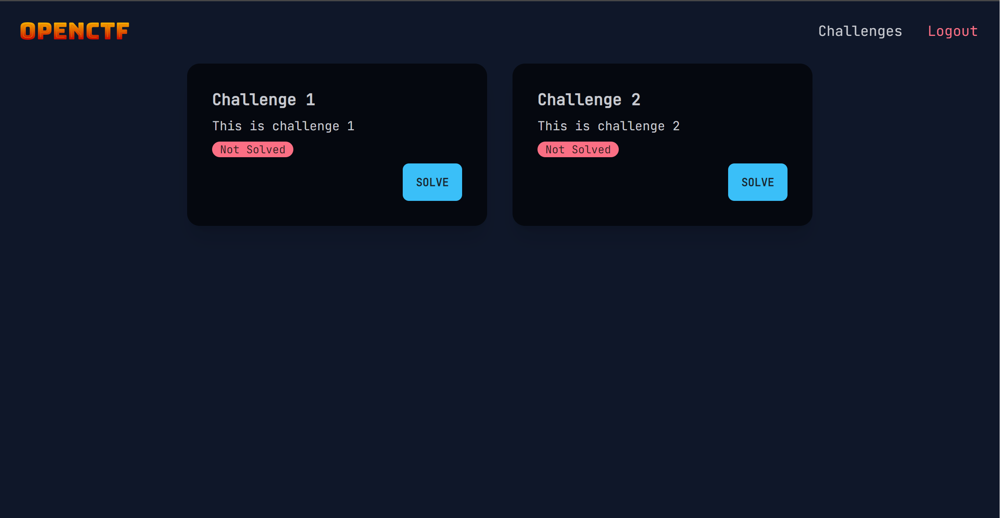
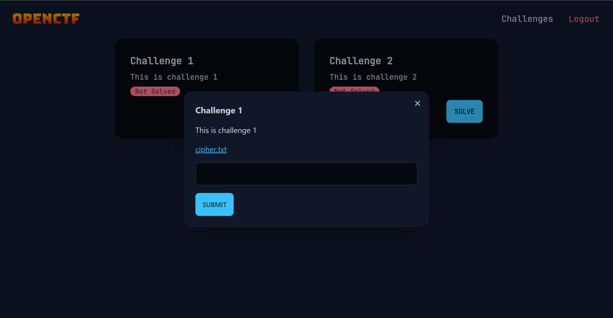

# OpenCTF

A KISS(Keep It Stupid Simple) CTF platform.

# Instructions
 * Execute `npm i` in both the client and server directories.
 * Run `npm start` in the server directory.
 * Run `npm run dev` in the client directory.
 * The website should be running on `http://localhost:5173`
